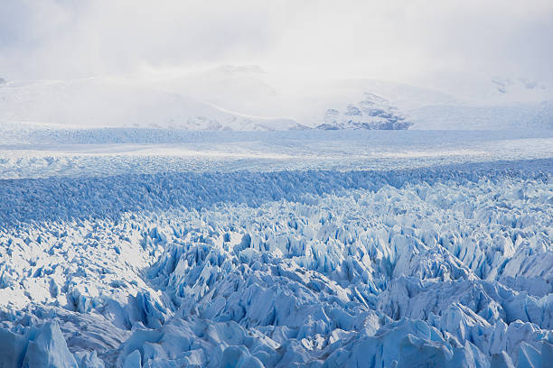

# geo-ice-age

**A python package demo for ice age analysis**

-   Free software: MIT License
-   Documentation: https://plan-9-from-outer-space.github.io/geo-ice-age
    

## Features

-   Common module contains useful functions.

## Project Images

-   
