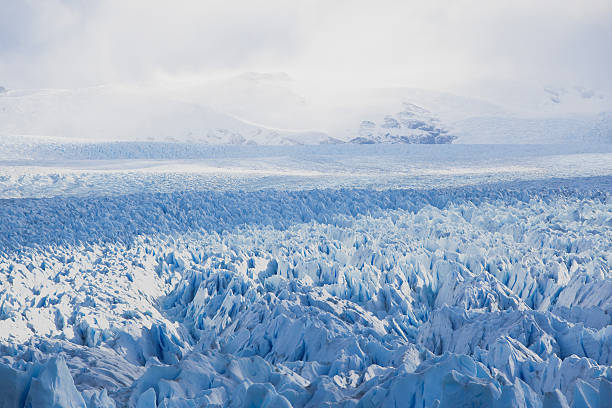

# Welcome to geo_ice_age

**A python package demo for ice age analysis**

-   Free software: MIT License
-   Documentation: <https://plan-9-from-outer-space.github.io/geo_ice_age>
    

## Features

-   Common module contains useful functions.

## Project Images

-   

